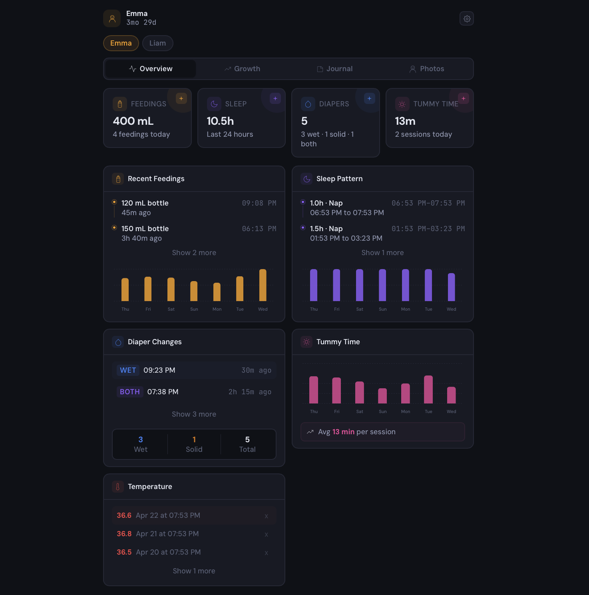
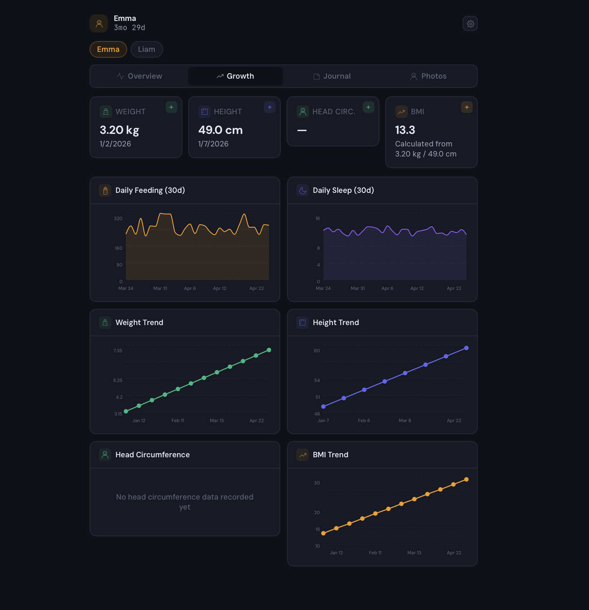
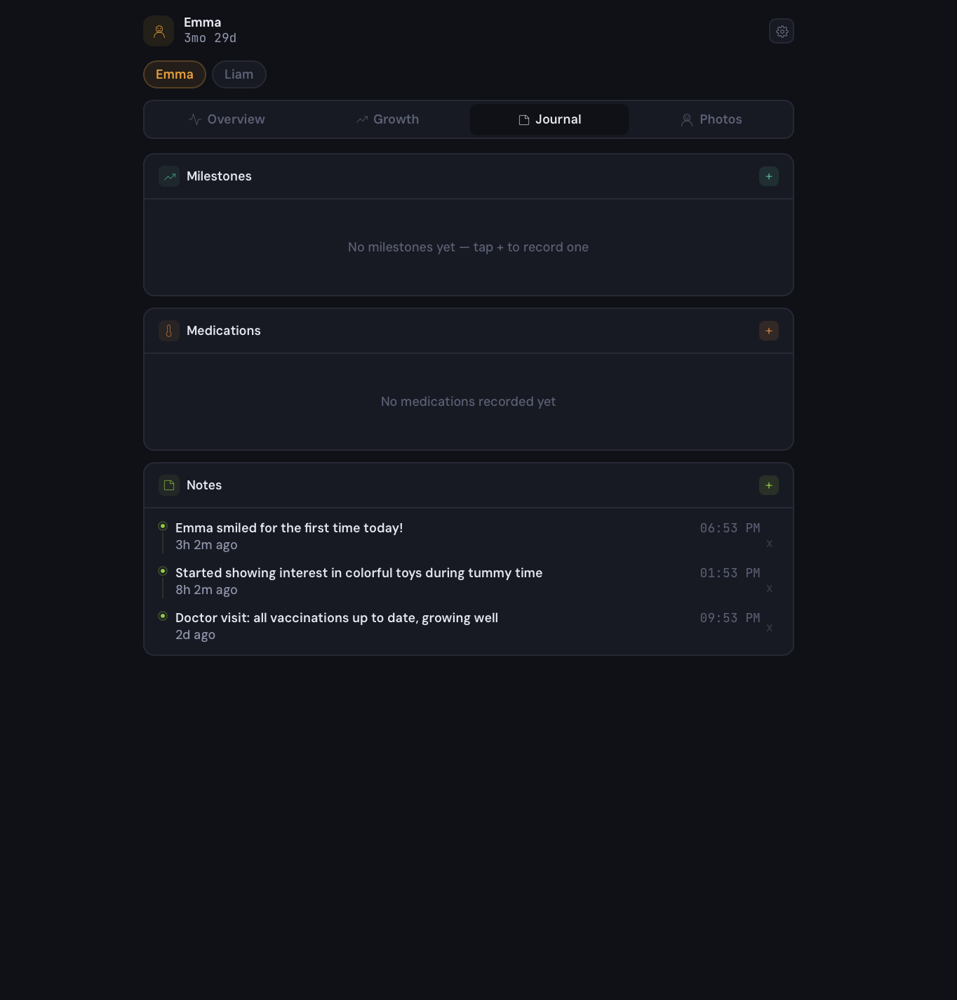
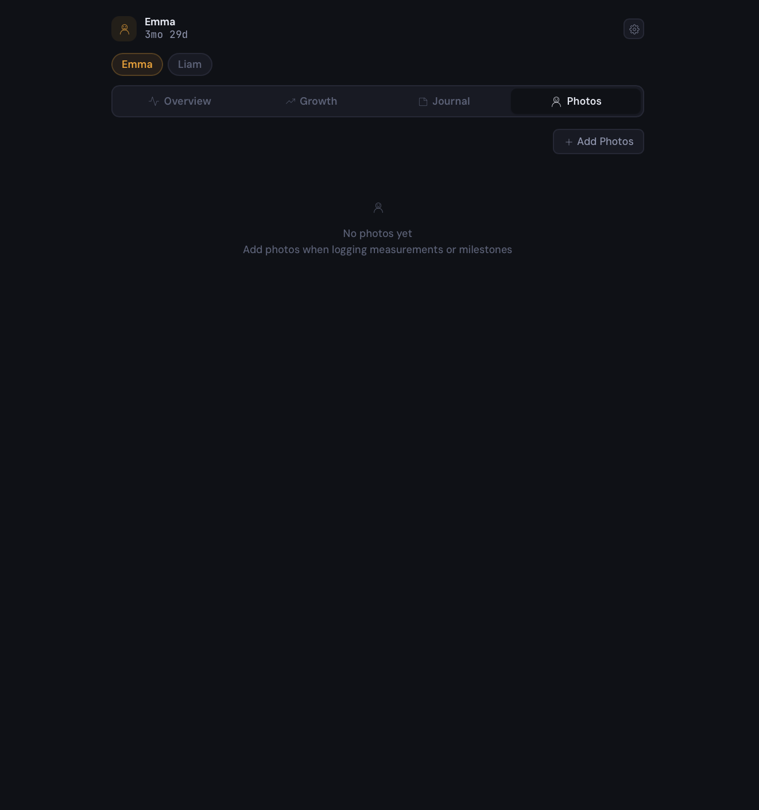

# BabyTracker User Guide

A practical guide for parents using BabyTracker to track their baby's daily activities, growth, and milestones.

---

## Getting Started

On first launch you'll see three options:

- **Start fresh** — create a new admin account, then add your baby.
- **Restore from a backup** — upload a `.tar.gz` (or `.tar.gz.enc` if encrypted) backup file. After the restore completes, sign in with the **credentials from the original server**; you will not be asked to create a new account.
- **Import from Baby Buddy** — create an admin account, then enter your Baby Buddy URL and API token to migrate existing data.

For a fresh install, after creating the account:

1. **Add your baby.** Enter the first name, last name (optional), birth date, and — if you want WHO growth percentile charts — sex.
2. **Start tracking.** The main screen shows your baby's dashboard, where you can see today's activity at a glance and log new entries.

To **add another baby** later, tap your current baby's name or photo to open the edit screen; there is an "+ Add Your Baby" button at the top right.

---

## The Dashboard

Your baby's dashboard is organized into four tabs:

- **Overview** -- Today's summary at a glance: last feeding, last sleep, last diaper change, and any active timers.

  

- **Growth** -- Charts showing weight, height, head circumference, and BMI over time, with optional WHO percentile overlays.

  

- **Journal** -- A chronological log of all entries. You can filter by activity type to find what you need.

  

- **Photos** -- A gallery of all photos attached to entries, milestones, measurements, and standalone uploads.

  

---

## Tracking Activities

### Feedings

Record what your baby eats and how.

- **Type:** Breast milk, formula, fortified breast milk, or solid food.
- **Method:** Bottle, left breast, right breast, both breasts, parent fed, or self fed.
- **Amount and duration:** Optionally record how much (in ml or oz) and how long the feeding lasted.
- **Timer support:** Start a timer when a feeding begins, then log the details when it is done.

### Sleep

Track when your baby sleeps.

- Record a start and end time.
- Mark whether it was a nap or nighttime sleep.
- Timer support: start a timer at bedtime and stop it when your baby wakes.

### Diapers

Log diaper changes quickly.

- Mark the diaper as wet, solid, or both.
- Optionally track the color (black, brown, green, or yellow) -- helpful for newborns.

### Tummy Time

Track tummy time sessions.

- Record a start and end time.
- Add optional milestone notes (e.g., "lifted head for 10 seconds").
- Timer support.

### Temperature

Record temperature readings when your baby is unwell or for routine checks.

### Weight, Height, Head Circumference

Track growth measurements over time. These are displayed as charts on the Growth tab so you can see trends.

If your child's sex is set (in the edit-child screen), you can toggle **WHO** on any of the Weight/Height/Head Circumference/BMI charts to overlay the official [WHO growth percentile curves](https://www.who.int/tools/child-growth-standards). Your child's measurements appear as dots against the 3rd / 15th / 50th / 85th / 97th percentile lines. The overlay is for reference only — consult your paediatrician for medical advice.

### BMI

Body mass index can be calculated automatically from weight and height, or entered manually.

### Medications

Keep a record of any medications your baby takes.

- Name of the medication.
- Dosage amount and unit.
- Time it was given.

### Milestones

Record your baby's developmental milestones -- first smile, first steps, first words, and everything in between. You can attach a photo to each milestone.

### Notes

A simple way to jot down general observations that do not fit neatly into other categories.

### Pumping

Track pumping sessions with the amount collected and the duration.

---

## Using Timers

Timers make logging faster and more accurate.

1. Tap the timer button on the main screen to start a timer.
2. The timer runs in the background -- you can close the app and come back later.
3. When you are done, tap the timer to open a pre-filled form with the duration already calculated.
4. Timers are per-child, so they will not get mixed up if you are tracking more than one baby.

---

## Photos

- **Attach photos to entries.** When logging a feeding, milestone, measurement, or any other activity, you can attach a photo.
- **Upload photos directly.** Go to the Photos tab to upload photos without attaching them to a specific entry.
- **Profile pictures.** Set a profile picture for each child.
- **Tag photos with children.** Photos can be tagged with one or more children so they appear in the right gallery.
- **Cross-child tagging.** Each gallery only lists photos tagged to the child it belongs to (plus untagged shared photos). To add a second child's tag to a photo, open it in the gallery of a child it is already tagged to and tick the other child's name there — you can't add the first tag to a photo from a sibling's gallery.
- **Click to enlarge.** Tap any photo in the gallery to open it full-screen. Use the left/right arrows (or keyboard arrow keys) to browse, Escape or tap outside to close.
- Untagged photos are treated as shared and will appear in every child's gallery.
- The gallery displays thumbnails for fast loading; full-resolution originals are used only when a photo is opened or shown in picture frame mode.

---

## Picture Frame Mode

Turn a spare tablet into a digital photo frame that cycles through your baby's pictures.

- **Idle timeout:** In Settings → Preferences → Picture Frame, set an idle timeout so picture frame mode activates automatically after a period of inactivity.
- **Always-on mode:** Add `?slideshow=true` to the URL to start picture frame mode immediately.
- **Filter photos:** In Settings → Preferences → Picture Frame, choose which types of photos to include in the slideshow.
- **Live status overlay:** Optionally show small status items on top of the slideshow — time since last feeding / sleep / diaper, running timers, or the current time. Configurable per-item in Settings → Preferences → Picture Frame → Live status overlay.
- **Live updates:** When someone uploads a new photo anywhere, every active slideshow picks it up within a few seconds and shows it as the next slide — no restart needed.
- **Remote control:** If you have named your device in Settings, you can control picture frame mode from another device via **Settings → Server → Display Control** (admin-only), or via the Display Control API from Home Assistant. Target one device by name or broadcast to every connected display.

---

## Settings

### Per-device vs. shared settings

Some settings are saved **in this device's browser only**, others are stored on the BabyTracker server and **apply to every user and device**. This is intentional — it lets you tailor each device to how it is used:

- A wall-mounted tablet can run in dark theme with a long picture-frame timeout; your phone stays on light theme with no slideshow.
- Your partner can have a different language than you without changing yours.
- A kitchen iPad can hide features you rarely track on that device, keeping the interface simple.
- Form defaults (your preferred feeding type, diaper color, etc.) can differ per device — useful if one device is typically used at night and another during the day.

**Per-device** (saved in the browser, different on every phone/tablet/computer):
- Unit system
- Theme
- Language
- Picture frame timeout and overlay items
- Device name
- Feature visibility toggles
- Form defaults (feeding type/method, diaper color, medication dosage unit, auto-calculate BMI)

**Shared** (stored on the server, same for everyone):
- Your user account and password
- Children and all tracked data (feedings, sleep, photos, etc.)
- Backup destinations and their schedules
- API tokens and webhooks
- Users and roles
- TLS/HTTPS certificate, domain, device restart/shutdown (Server tab, admin)

If you clear your browser data or sign in from a new device, the per-device settings reset to defaults — your tracked data is not affected.

Settings are organized into six tabs in the sidebar (fewer if you're not an admin):

- **Preferences** — per-device settings (see below)
- **Data** — export, tags, backups
- **Integrations** (admin) — API tokens, webhooks
- **Server** (admin) — storage, display control, TLS/HTTPS, restart/shutdown
- **Account** — change password, sign out
- **Users** (admin) — users, roles, child access

### Preferences

Everything on this tab is stored in your browser and applies only to this
device. The tab is split into sections:

**Appearance + device**

- **Unit system:** metric or imperial.
- **Theme:** light, dark, or match your system setting.
- **Language:** English, Spanish, or Danish.
- **Device name:** give this device a name used for remote display control and HA integrations.

**Picture frame** — all the slideshow controls. Timeout, slide duration,
which child's photos to show, which entry types (milestones, weights…) to
include, and the live status overlay toggles.

**Features** — toggle which tracking features are visible on this device.
If you don't track pumping or medications, for example, you can hide them
to keep the interface simple.

**Defaults** — save time by setting default values for things you log often:

- Default feeding type and method.
- Default diaper color.
- Default medication dosage unit.
- Auto-calculate BMI from weight + height.

### Data

- **Export as CSV:** Download all your data as a spreadsheet-friendly CSV file.
- **Backup destinations:** Add one or more places where backups should be stored. Each destination is independent — you can mix a local folder with a remote WebDAV server, give them different schedules, retention counts, and encryption settings.
- **Backups:** Create a manual backup, download/restore/delete existing ones, choose which destinations a manual backup should be sent to.
- **Import from Baby Buddy:** If you are migrating from Baby Buddy, you can import your existing data.

#### Backup destinations in detail

A fresh install ships with a single **Local** destination pointing at the server's data directory, with a daily 03:00 backup and a 7-backup retention. Click **+ Add destination** to set up more.

**Types**

- **Local path** — any directory on the server. Useful for USB sticks, NFS mounts, or external drives.
- **WebDAV** — generic WebDAV. Works with Nextcloud, ownCloud, Synology WebDAV, Infomaniak kDrive, and similar.
  - For Nextcloud, the URL has the form `https://your-nextcloud/remote.php/dav/files/USERNAME/`.
  - Use a **Nextcloud app password** (Settings → Personal → Security → Devices & sessions), not your login password — especially if 2FA is enabled.
  - **TLS verification** — choose one of:
    - *Verify normally* (default): the server's certificate must be signed by a trusted CA. Works for public providers (Nextcloud Cloud, Infomaniak kDrive) or any server with a Let's Encrypt certificate.
    - *Trust a specific certificate*: for home servers (Synology DSM, TrueNAS, QNAP) that use a self-signed certificate. Click **Fetch certificate**, compare the displayed SHA-256 fingerprint against what your server's admin panel shows, then click OK to pin it. The connection now succeeds only with that exact certificate — an attacker on your network can't swap it out.
    - *Skip verification*: for LAN servers where you accept that an on-network attacker could impersonate the server. Required for plain-HTTP WebDAV (which also sends your credentials and backup contents in cleartext — avoid except on fully trusted wired LANs).
- **S3-compatible** — AWS S3 and any service speaking the S3 API: Cloudflare R2, Backblaze B2, MinIO, Wasabi, DigitalOcean Spaces, etc.
  - **Bucket / Region / Prefix** — bucket name, region (`auto` for R2, `us-east-1` etc. for AWS), and optional key prefix (a folder within the bucket).
  - **Access Key ID / Secret Access Key** — prefer scoped credentials. A minimal policy only needs `PutObject`, `GetObject`, `DeleteObject` and `ListBucket` on the single bucket. **Do not use account-wide or root keys** — a leak could cost real money.
  - **Endpoint URL** — leave blank for AWS. For other services, use the provider's endpoint (e.g. `https://<account-id>.r2.cloudflarestorage.com` for R2, `https://minio.internal:9000` for self-hosted MinIO).
  - **Use path-style addressing** — enable for MinIO, R2, and most non-AWS providers. Disable for AWS.
  - **Hardening worth doing on the bucket side:** enable object versioning so a leaked key can't permanently delete old backups, and set a lifecycle rule to expire non-current versions after 30 days.
  - Credentials entered here are **encrypted at rest** in the BabyTracker database using a key derived from the server's JWT secret — a leaked DB dump alone is not enough to recover them.

**Per-destination settings**

- **Schedule** — choose a preset (Off, Hourly, Every 6h, Every 12h, Daily, Weekly) or click **Custom** to enter your own cron expression. The friendly summary below ("Daily at 03:00", etc.) tells you exactly what's about to happen. Schedules run in the server's local timezone.
- **Retention** — how many backups to keep at this destination. Older ones are pruned after each successful upload.
- **Encryption** — opt in to AES-256-GCM with a passphrase you choose. The passphrase is needed to restore. You can let the server store it (required for scheduled backups, but reduces protection if the server itself is compromised), or be prompted manually for each backup.
- **Test** — verifies connectivity (and credentials, for WebDAV) before the first scheduled run.

**Restoring**

- From an existing instance: pick a destination, select a backup from the list, and restore. If the backup is encrypted, you'll be asked for the passphrase. You can also restore by uploading a `.tar.gz` (or `.tar.gz.enc`) file directly.
- On a brand-new instance: the first-boot screen has a **Restore from a backup** option. After the restore completes, sign in with the credentials from the original server — the backup includes the user accounts.
- Restore always wipes and recreates the database schema. The **Delete photos not in this backup** checkbox controls what happens to existing photo files: leave it unchecked when your photos directory is shared with another app (e.g. Home Assistant media), check it for a clean restore on a dedicated install.

### Integrations (admin only)

- **API tokens:** Create tokens so external systems (Home Assistant, scripts, etc.) can read or write your data. Choose Read only or Read & Write scope.
- **Webhooks:** Send HTTP notifications to another system whenever data changes. Useful for triggering automations outside BabyTracker.

### Server (admin only)

- **Storage:** Disk usage for the system and (where applicable) the BabyTracker data volume, with colour-coded progress bars that turn orange >75% and red >90%.
- **Display control:** Push picture frame on/off to specific tablets or broadcast to every connected device. The list shows which devices are currently connected via SSE.
- **TLS / HTTPS:** Configure a Let's Encrypt certificate via DNS-01 challenge with Cloudflare, Route53, DuckDNS, Namecheap, or Simply.com. Auto-renews 30 days before expiry. The server starts immediately with a self-signed certificate; the Let's Encrypt cert is obtained in the background and swapped in without a restart.
- **Custom domain** (appliance mode only): point a domain at the device.
- **Restart / Shut down** (appliance mode only): safely reboot or power down the device.

### Account

- **Change password:** update your login password.
- **Sign out:** log out of this browser.

### Users & Roles (admin only)

- **Create accounts:** Add user accounts for partners, grandparents, or caregivers.
- **Create custom roles:** Define roles with specific permissions per feature (none, read, or write).
- **Grant access:** Assign users access to specific children with specific roles.
- **Reset passwords:** Reset the password for any user account.

---

## Multi-Child Support

- Add multiple children from the dashboard.
- Switch between children using the selector at the top of the screen.
- Each child has independent data, photos, and a profile picture.
- Users can be granted access to specific children, so you can share selectively.

---

## Home Assistant

If you use Home Assistant, there is a dedicated integration that exposes per-child sensors, fires events when new activity is logged, and provides services to log activities from automations. See the [babytracker-homeassistant](https://github.com/mbentancour/babytracker-homeassistant) repository for installation and examples.

Typical things you can do:

- Show a card on your dashboard with "last feeding was 2h 15m ago"
- Get a phone notification if temperature is above 38°C
- Turn on a nightlight when a sleep timer is running
- Tap a button to log a wet diaper without opening the app
- Start the picture frame slideshow on a bedroom tablet when the lights go off

## Tips

- **Use timers for feedings and sleep.** They make logging much faster and you will not have to remember exact start times.
- **Check the Journal tab for patterns.** It is a great way to spot trends in sleep, feeding, or diaper changes.
- **Set up at least one off-machine backup destination.** Go to Settings > Data > Backup destinations and add a WebDAV (Nextcloud, etc.) target. A backup that lives only on the same SD card as the database is one card failure away from being useless.
- **Try picture frame mode on a tablet.** It is a lovely way to display your favorite baby photos as a screensaver when the tablet is not in use.
